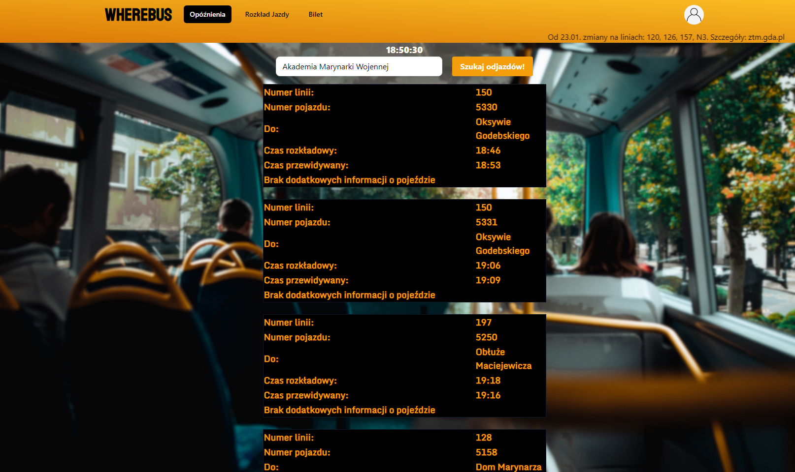
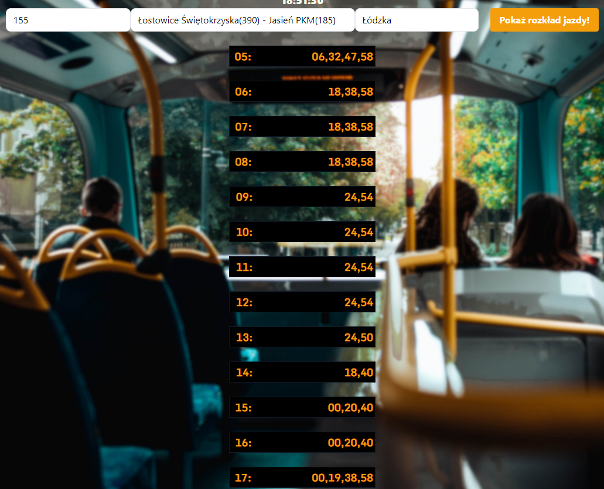
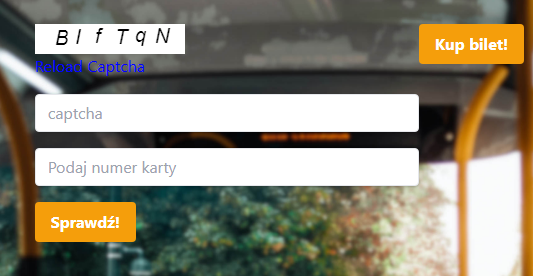

# WhereBus

Sama aplikacja nie jest najlepiej napisana i wiele rzeczy jest hardcoded, ze względu na to że dopiero zaczynaliśmy się uczyć pisania aplikacji webowych.
Był to projekt na zaliczenie przedmiotu **"Zespołowe przedsięwzięcie inżynierskie"** i wiele rzeczy było robione żeby po prostu działało.

Na stronie głównej mamy selecta z listą przystanków (hardcoded), po wybraniu z listy klikamy szukaj i wyświetlają nam się autobusy które mają przyjechać
z informacjami o godzinie rozkładowej, rzeczywistej. Przy niektórych autobusach można znaleźć informację o AED, gniazdach USB, czy klimatyzacji.

Mamy także rozkład jazdy, w którym wybieramy busa, kierunek i przystanek. Z rozkładem jazdy były nie małe problemy związane z bałaganem który występuje w bazie danych.
Nie pomagało to też że jeszcze nie do końca potrafiliśmy dobrze wykorzystać JSON i poprawnie przerzucić dane z obiektu.

Na koniec mamy sprawdzanie numeru biletu miesięcznego, tutaj akurat za dużej logiki nie ma. Dodaliśmy dodatkowo Captche i link do strony z zakupem biletu.

Poważnym błędem z naszej strony było zrobienie wszystkiego bez pośrednio w React.js, co powoduje beznadziejną optymalizację.
